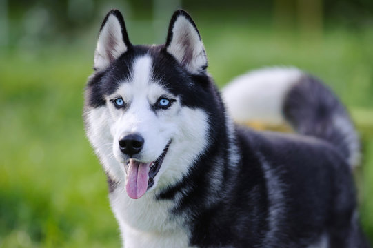

Barbara G.
---
title: "Some cool animal facts"
author: "Philip Leftwich"
format: html
execute:
  echo: true
---

##### A note on this project:

## This project developed from Allison Horst's very cool intro to GitHub.

### Cool animal fun facts

::: {.panel-tabset}

#### DOGS

### 3 fun facts about dogs (from [American Kennel Club](https://www.akc.org/expert-advice/lifestyle/dog-facts/)):

1. A dog’s nose print is unique, much like a person’s fingerprint.
2. Their sense of smell is legendary. Their nose has as many as 300 million receptors.
3. Dogs are among a small group of animals who show voluntary unselfish kindness towards others without any reward.

#### SHARKS!!!

##### Some great white shark facts (from [NatGeo Kids](https://www.natgeokids.com/uk/discover/animals/sea-life/great-white-sharks/)):

- Great white sharks have ~ 300 teeth
- And swim way faster than you (25 mph)
- And are listed as vulnerable on the IUCN Red List

#### California condors

##### Some California condor facts (from [Animal Fact Guide](https://animalfactguide.com/animal-facts/california-condor/)):

- By 1987, there were only 10 California condors living in the wild
- They are the largest flying bird in North America
- Critically endangered on the IUCN Red List (> 400 today)

#### American pika

##### Some American pika facts (from [OneKindPlanet.org](https://onekindplanet.org/animal/pika-american/)):

- Pika are of order *Lagomorpha* (which also includes rabbits)
- Pika live in high altitude talus slopes
- American pika are already disappearing from the Sierra Nevada

#### Ringtail cats

##### Ringtail cats fun facts: 

- Can rotate their hind feet 180 degrees to climb better
- They are not endangered, just very elusive
- Closely related to raccoons

:::

----------
**Disclaimer:** This document is only for R Markdown & GitHub teaching purposes